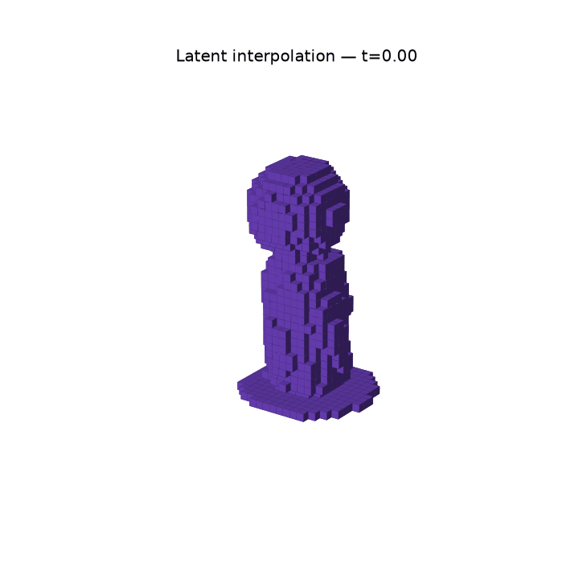

# Controllable Generative Modeling of 3D Trophy Geometry

This project investigates whether neural networks can learn interpretable
and controllable latent representations of procedurally generated 3D
geometry.

A parameterized basketball trophy generator is used to create
approximately 10,000 related 3D objects with known geometric properties.
The meshes are converted to 32×32×32 occupancy grids and modeled using a
3D convolutional autoencoder (AE) and variational autoencoder (VAE).

The project evaluates reconstruction, generation, latent-space
interpretability, controllable editing, disentanglement, and
gradient-based shape optimization.


> **Semantic latent traversals.** Starting from the same encoded trophy,
> moving along linear-probe directions produces consistent changes in ball
> radius, support sweep, and lower-base radius.

## Key Findings

- Both models reconstruct held-out geometry accurately. The AE reaches
  0.9145 IoU, while the VAE achieves 0.9280 IoU.
- Five known geometric properties are strongly linearly accessible in the
  learned latent space, with R² above 0.90.
- Linear-probe directions support controllable edits, although the directions
  are not perfectly disentangled.
- Standard-normal VAE sampling remains unreliable despite strong
  reconstruction performance, with 49% of generated samples empty.
- Gradient-based latent optimization changes multiple predicted geometric
  objectives while preserving a coherent decoded shape.

## Research Questions

1. Can a neural model accurately reconstruct unseen trophy geometry?
2. Can a generative model produce novel, valid trophy-like shapes?
3. Does the learned latent representation encode known geometric properties?
4. Can learned latent directions controllably manipulate individual geometric properties?
5. Can the learned representation support gradient-based shape optimization?

## Pipeline

```text
Parameterized Trophy Generator
            |
            v
     Procedural Dataset
            |
            v
        OBJ Meshes
            |
            v
    32^3 Voxelization
            |
       +----+----+
       |         |
       v         v
   3D AE       3D VAE
       |         |
       v         v
 Latent Space  Sampling
       |
       +-- Interpolation
       +-- Linear Property Probes
       +-- Semantic Latent Editing
       +-- Disentanglement Analysis
       +-- Shape Optimization
```

## Procedural Parameters

The dataset contains ten known geometric controls:

- `ball_radius`
- `ball_offset`
- `support_sweep`
- `body_height`
- `body_bottom_radius`
- `body_top_radius`
- `lower_base_radius`
- `lower_base_height`
- `upper_base_radius`
- `upper_base_height`

These parameters provide ground-truth labels for latent-space analysis.

## Dataset

> **Note:** The generated dataset can be reproduced using
> `src/data/generate_dataset.py` followed by `src/data/voxelize.py`.

Approximately 10,000 procedural trophies are generated.


> **Dataset examples.** A fixed-view sample from the procedurally generated
> dataset, which varies across ten explicit geometric controls.

The dataset is divided deterministically using random seed 42:

- 80% training
- 10% validation
- 10% testing

Each mesh is normalized and converted into a 32×32×32 binary occupancy
grid.

Generated datasets are not stored in Git because of their size and can
be recreated using the scripts in `src/data/`.

## Models

### 3D Autoencoder

The deterministic autoencoder maps each occupancy grid to a
32-dimensional latent representation and reconstructs the original
geometry.

### 3D Variational Autoencoder

The VAE learns a probabilistic 32-dimensional representation using a
reconstruction objective combined with KL regularization.

## Main Results

### Reconstruction

| Model | BCE ↓ | IoU ↑ | Dice ↑ |
|---|---:|---:|---:|
| Autoencoder | 0.019870 | 0.9145 | 0.9551 |
| VAE | **0.016471** | **0.9280** | **0.9625** |

Both models reconstruct held-out trophy geometry accurately. In the current
evaluation, the VAE slightly outperforms the deterministic autoencoder on
BCE, IoU, and Dice.


> **Held-out reconstructions.** Original voxel grids (top), deterministic AE
> reconstructions (middle), and VAE mean reconstructions (bottom).

### Latent Interpolation



> **Latent interpolation.** Linear interpolation between two encoded test
> trophies produces a sequence of intermediate decoded geometries.

### Latent-Space Property Prediction

Several geometric properties are highly linearly predictable from the
autoencoder latent representation.

| Parameter | R² |
|---|---:|
| lower_base_radius | 0.9590 |
| ball_radius | 0.9474 |
| body_bottom_radius | 0.9397 |
| body_top_radius | 0.9299 |
| support_sweep | 0.9025 |
| body_height | 0.8631 |
| lower_base_height | 0.5456 |
| upper_base_height | 0.3204 |
| ball_offset | 0.2571 |
| upper_base_radius | 0.1485 |

The results show that latent interpretability is property-dependent:
several major geometric properties are encoded in a highly linearly
accessible form, while others are substantially weaker.

### VAE Generation

Generation quality was evaluated by drawing 100 latent vectors from the
standard-normal prior, `z ~ N(0, I)`, using random seed 42.

| Metric | Result |
|---|---:|
| Samples | 100 |
| Sampling standard deviation | 1.0 |
| Empty samples | 49% |
| Fully connected samples | 28% |
| More than 99% in largest component | 29% |
| More than 95% in largest component | 31% |
| Mean largest-component fraction | 0.4483 |

Although the VAE achieves good reconstruction accuracy, random generation
from the standard-normal prior remains unreliable. Forty-nine of the 100
samples were empty, and several nonempty samples contained only a very small
number of occupied voxels.

These findings indicate that good reconstruction does not necessarily imply
that arbitrary points drawn from the prior will decode into valid trophy
geometry. The VAE should therefore be considered successful for reconstruction
and latent-space analysis, but not yet a consistently reliable random shape
generator.


> **VAE generation.** Samples drawn from the standard-normal latent prior
> using `SAMPLE_STD = 1.0`. The samples illustrate the variation in occupancy
> and geometric connectivity.

### Latent Editing

Linear probe directions were used as candidate semantic directions for:

- ball radius
- support sweep
- body height
- body bottom radius
- body top radius
- lower base radius

Editing experiments demonstrate controllable geometric changes.
A separate disentanglement analysis measures unintended effects on other
known procedural properties.


### Shape Optimization

Gradient-based optimization was performed directly in latent space.

One experiment increased predicted lower-base radius while decreasing
predicted ball radius:

```text
Predicted lower-base radius: 1.2643 -> 1.2923
Predicted ball radius:       0.9230 -> 0.7578
```

The decoded trophy remained geometrically coherent throughout the
optimization trajectory.


> **Latent-space optimization.** Decoded shapes across the optimization
> trajectory and the corresponding linear-probe predictions.

## Repository Structure

```text
src/
├── geometry/
│   └── trophy.py
├── data/
│   ├── generate_dataset.py
│   ├── voxelize.py
│   ├── dataset.py
│   └── inspect_dataset.py
├── models/
│   ├── autoencoder.py
│   └── vae.py
├── training/
│   ├── train_ae.py
│   └── train_vae.py
└── analysis/
    ├── evaluate_ae.py
    ├── interpolate.py
    ├── latent_probe.py
    ├── latent_edit.py
    ├── measure_latent_edits.py
    ├── shape_optimization.py
    ├── check_vae_latent.py
    ├── sample_vae.py
    ├── evaluate_vae_samples.py
    ├── compare_ae_vae.py
    ├── generate_readme_images.py
    ├── summarize_results.py
    └── validate_submission.py
```

## Installation

```bash
python -m venv .venv
source .venv/bin/activate
pip install -r requirements.txt
```

## Reproducing the Pipeline

Generate the procedural dataset:

```bash
python src/data/generate_dataset.py
```

Voxelize the meshes:

```bash
python src/data/voxelize.py
```

Train the autoencoder:

```bash
python src/training/train_ae.py
```

Evaluate the autoencoder:

```bash
python src/analysis/evaluate_ae.py
```

Run latent-space analysis:

```bash
python src/analysis/interpolate.py
python src/analysis/latent_probe.py
python src/analysis/latent_edit.py
python src/analysis/measure_latent_edits.py
```

Run latent-space optimization:

```bash
python src/analysis/shape_optimization.py
```

Train the VAE:

```bash
python src/training/train_vae.py
```

The reported VAE used a maximum KL weight of `0.001` with a 20-epoch
linear warmup. The final beta was reached at epoch 20:

```text
epoch 1:  beta=0.000050
epoch 10: beta=0.000500
epoch 20: beta=0.001000
```

The selected post-warmup checkpoint achieved:

```text
validation loss:           0.019664
validation reconstruction: 0.016588
validation KL:             3.076206
```

Analysis scripts load `outputs/checkpoints/vae_best.pt`. Random generation
uses 100 samples, `SAMPLE_STD = 1.0`, and seed 42.

Evaluate the VAE:

```bash
python src/analysis/check_vae_latent.py
python src/analysis/sample_vae.py
python src/analysis/evaluate_vae_samples.py
```

Compare models and summarize results:

```bash
python src/analysis/compare_ae_vae.py
python src/analysis/summarize_results.py
```

### Generate the README Figures

After producing the dataset and experiment outputs above, generate all README
images:

```bash
python src/analysis/generate_readme_images.py --strict
```

The script reads generated data from `data/` and `outputs/`, then writes the
small, GitHub-ready figures to `docs/images/`. The raw `outputs/` directory
remains ignored because it contains checkpoints and experiment artifacts. To
regenerate only selected figures, use `--only`, for example:

```bash
python src/analysis/generate_readme_images.py --only traversals optimization
```

Commit the rendered figures with the code and README:

```bash
git add README.md src/analysis/generate_readme_images.py docs/images/
```

Validate the final project:

```bash
python src/analysis/validate_submission.py
```

## Limitations

The current representation uses relatively low-resolution 32³ occupancy
grids. This is sufficient for studying learned representations but does
not provide manufacturing-level geometric precision.

The latent representation is not perfectly disentangled. High linear
predictability of a property does not imply that its latent direction
changes only that property.

The VAE also exhibits imperfect prior matching: standard-normal sampling
produced 49% empty samples and only 28% fully connected samples.
Reduced-variance sampling was not reevaluated using the final checkpoint.

## Future Work

Future extensions include:

- signed-distance or implicit neural representations
- higher-resolution geometry
- direct mesh or CAD representations
- improved latent disentanglement
- conditional generative models
- engineering-property predictors
- multi-objective latent-space optimization

These extensions would move the framework toward AI-assisted CAD and
generative engineering design.
