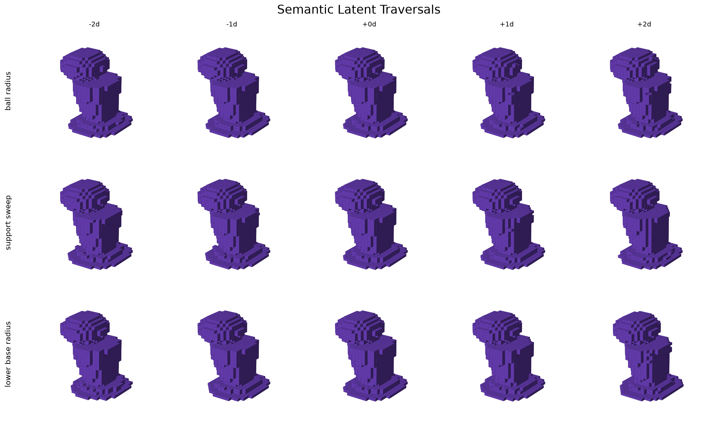
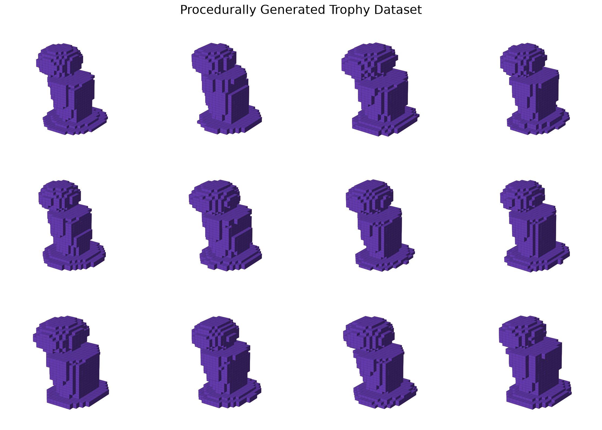
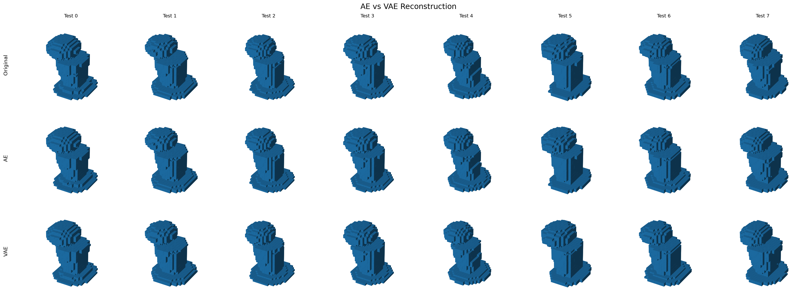
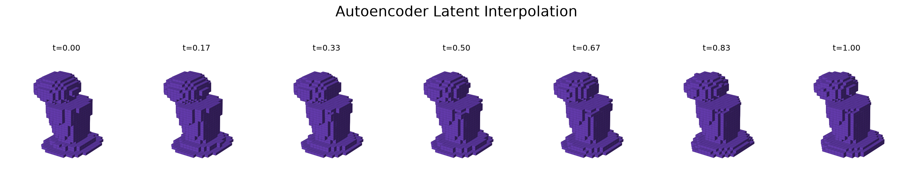
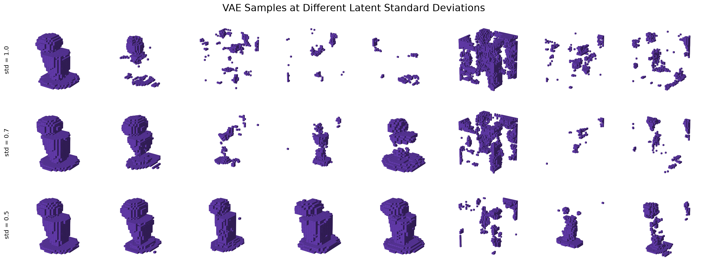
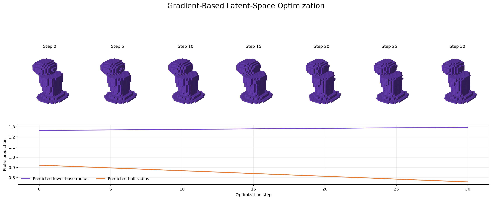

# Controllable Generative Modeling of 3D Trophy Geometry

This project investigates whether neural networks can learn interpretable
and controllable latent representations of procedurally generated 3D
geometry.

A parameterized basketball trophy generator is used to create
approximately 10,000 related 3D objects with known geometric properties.
The meshes are converted to 32×32×32 occupancy grids and modeled using a
3D convolutional autoencoder (AE) and variational autoencoder (VAE).

The project evaluates reconstruction, generation, latent-space
interpretability, controllable editing, disentanglement, and
gradient-based shape optimization.



> **Semantic latent traversals.** Starting from the same encoded trophy,
> moving along linear-probe directions produces consistent changes in ball
> radius, support sweep, and lower-base radius.

## Key Findings

- The AE reconstructs held-out geometry with 0.9946 IoU; the VAE reaches
  0.9870 IoU.
- Five known geometric properties are strongly linearly accessible in the
  learned latent space, with R² above 0.90.
- Linear-probe directions support controllable edits, although the directions
  are not perfectly disentangled.
- Reduced-variance VAE sampling produces substantially more connected
  geometry than standard-normal sampling in this experiment.
- Gradient-based latent optimization changes multiple predicted geometric
  objectives while preserving a coherent decoded shape.

## Research Questions

1. Can a neural model accurately reconstruct unseen trophy geometry?
2. Can a generative model produce novel, valid trophy-like shapes?
3. Does the learned latent representation encode known geometric properties?
4. Can learned latent directions controllably manipulate individual geometric properties?
5. Can the learned representation support gradient-based shape optimization?

## Pipeline

```text
Parameterized Trophy Generator
            |
            v
     Procedural Dataset
            |
            v
        OBJ Meshes
            |
            v
    32^3 Voxelization
            |
       +----+----+
       |         |
       v         v
   3D AE       3D VAE
       |         |
       v         v
 Latent Space  Sampling
       |
       +-- Interpolation
       +-- Linear Property Probes
       +-- Semantic Latent Editing
       +-- Disentanglement Analysis
       +-- Shape Optimization
```

## Procedural Parameters

The dataset contains ten known geometric controls:

- `ball_radius`
- `ball_offset`
- `support_sweep`
- `body_height`
- `body_bottom_radius`
- `body_top_radius`
- `lower_base_radius`
- `lower_base_height`
- `upper_base_radius`
- `upper_base_height`

These parameters provide ground-truth labels for latent-space analysis.

## Dataset

> **Note:** The generated dataset can be reproduced using
> `src/data/generate_dataset.py` followed by `src/data/voxelize.py`.

Approximately 10,000 procedural trophies are generated.



> **Dataset examples.** A fixed-view sample from the procedurally generated
> dataset, which varies across ten explicit geometric controls.

The dataset is divided deterministically using random seed 42:

- 80% training
- 10% validation
- 10% testing

Each mesh is normalized and converted into a 32×32×32 binary occupancy
grid.

Generated datasets are not stored in Git because of their size and can
be recreated using the scripts in `src/data/`.

## Models

### 3D Autoencoder

The deterministic autoencoder maps each occupancy grid to a
32-dimensional latent representation and reconstructs the original
geometry.

### 3D Variational Autoencoder

The VAE learns a probabilistic 32-dimensional representation using a
reconstruction objective combined with KL regularization.

## Main Results

### Reconstruction

| Model | BCE ↓ | IoU ↑ | Dice ↑ |
|---|---:|---:|---:|
| Autoencoder | 0.000980 | 0.9946 | 0.9973 |
| VAE | 0.002329 | 0.9870 | 0.9934 |

The deterministic autoencoder provides the strongest reconstruction
performance, while both models reconstruct unseen trophy geometry with
high accuracy.



> **Held-out reconstructions.** Original voxel grids (top), deterministic AE
> reconstructions (middle), and VAE mean reconstructions (bottom).

### Latent Interpolation



> **Latent interpolation.** Linear interpolation between two encoded test
> trophies produces a sequence of intermediate decoded geometries.

### Latent-Space Property Prediction

Several geometric properties are highly linearly predictable from the
autoencoder latent representation.

| Parameter | R² |
|---|---:|
| lower_base_radius | 0.9590 |
| ball_radius | 0.9474 |
| body_bottom_radius | 0.9397 |
| body_top_radius | 0.9299 |
| support_sweep | 0.9025 |
| body_height | 0.8631 |
| lower_base_height | 0.5456 |
| upper_base_height | 0.3204 |
| ball_offset | 0.2571 |
| upper_base_radius | 0.1485 |

The results show that latent interpretability is property-dependent:
several major geometric properties are encoded in a highly linearly
accessible form, while others are substantially weaker.

### VAE Generation

Generation quality was evaluated using connected-component statistics.

| Latent sampling std | Mean largest component | Fully connected |
|---:|---:|---:|
| 1.0 | 0.4662 | 9% |
| 0.7 | 0.9032 | 66% |
| 0.5 | 0.9695 | 86% |

The standard-normal prior does not always produce coherent geometry.
Reduced-variance sampling substantially improves connectivity.



> **VAE generation.** Samples decoded at three latent standard deviations.
> The same sample indices and rendering settings are used in every row.

The `std=0.5` experiment should be interpreted as reduced-variance
sampling rather than as evidence that the learned posterior perfectly
matches the standard-normal VAE prior.

### Latent Editing

Linear probe directions were used as candidate semantic directions for:

- ball radius
- support sweep
- body height
- body bottom radius
- body top radius
- lower base radius

Editing experiments demonstrate controllable geometric changes.
A separate disentanglement analysis measures unintended effects on other
known procedural properties.


### Shape Optimization

Gradient-based optimization was performed directly in latent space.

One experiment increased predicted lower-base radius while decreasing
predicted ball radius:

```text
Predicted lower-base radius: 1.2643 -> 1.2923
Predicted ball radius:       0.9230 -> 0.7578
```

The decoded trophy remained geometrically coherent throughout the
optimization trajectory.



> **Latent-space optimization.** Decoded shapes across the optimization
> trajectory and the corresponding linear-probe predictions.

## Repository Structure

```text
src/
├── geometry/
│   └── trophy.py
├── data/
│   ├── generate_dataset.py
│   ├── voxelize.py
│   ├── dataset.py
│   └── inspect_dataset.py
├── models/
│   ├── autoencoder.py
│   └── vae.py
├── training/
│   ├── train_ae.py
│   └── train_vae.py
└── analysis/
    ├── evaluate_ae.py
    ├── interpolate.py
    ├── latent_probe.py
    ├── latent_edit.py
    ├── measure_latent_edits.py
    ├── shape_optimization.py
    ├── check_vae_latent.py
    ├── sample_vae.py
    ├── evaluate_vae_samples.py
    ├── compare_ae_vae.py
    ├── generate_readme_images.py
    ├── summarize_results.py
    └── validate_submission.py
```

## Installation

```bash
python -m venv .venv
source .venv/bin/activate
pip install -r requirements.txt
```

## Reproducing the Pipeline

Generate the procedural dataset:

```bash
python src/data/generate_dataset.py
```

Voxelize the meshes:

```bash
python src/data/voxelize.py
```

Train the autoencoder:

```bash
python src/training/train_ae.py
```

Evaluate the autoencoder:

```bash
python src/analysis/evaluate_ae.py
```

Run latent-space analysis:

```bash
python src/analysis/interpolate.py
python src/analysis/latent_probe.py
python src/analysis/latent_edit.py
python src/analysis/measure_latent_edits.py
```

Run latent-space optimization:

```bash
python src/analysis/shape_optimization.py
```

Train and evaluate the VAE:

```bash
python src/training/train_vae.py
python src/analysis/check_vae_latent.py
python src/analysis/sample_vae.py
python src/analysis/evaluate_vae_samples.py
```

Compare models and summarize results:

```bash
python src/analysis/compare_ae_vae.py
python src/analysis/summarize_results.py
```

### Generate the README Figures

After producing the dataset and experiment outputs above, generate all README
images:

```bash
python src/analysis/generate_readme_images.py --strict
```

The script reads generated data from `data/` and `outputs/`, then writes the
small, GitHub-ready figures to `docs/images/`. The raw `outputs/` directory
remains ignored because it contains checkpoints and experiment artifacts. To
regenerate only selected figures, use `--only`, for example:

```bash
python src/analysis/generate_readme_images.py --only traversals optimization
```

Commit the rendered figures with the code and README:

```bash
git add README.md src/analysis/generate_readme_images.py docs/images/
```

Validate the final project:

```bash
python src/analysis/validate_submission.py
```

## Limitations

The current representation uses relatively low-resolution 32³ occupancy
grids. This is sufficient for studying learned representations but does
not provide manufacturing-level geometric precision.

The latent representation is not perfectly disentangled. High linear
predictability of a property does not imply that its latent direction
changes only that property.

The VAE also exhibits imperfect prior matching: standard-normal samples
are less geometrically reliable than reduced-variance samples.

## Future Work

Future extensions include:

- signed-distance or implicit neural representations
- higher-resolution geometry
- direct mesh or CAD representations
- improved latent disentanglement
- conditional generative models
- engineering-property predictors
- multi-objective latent-space optimization

These extensions would move the framework toward AI-assisted CAD and
generative engineering design.
